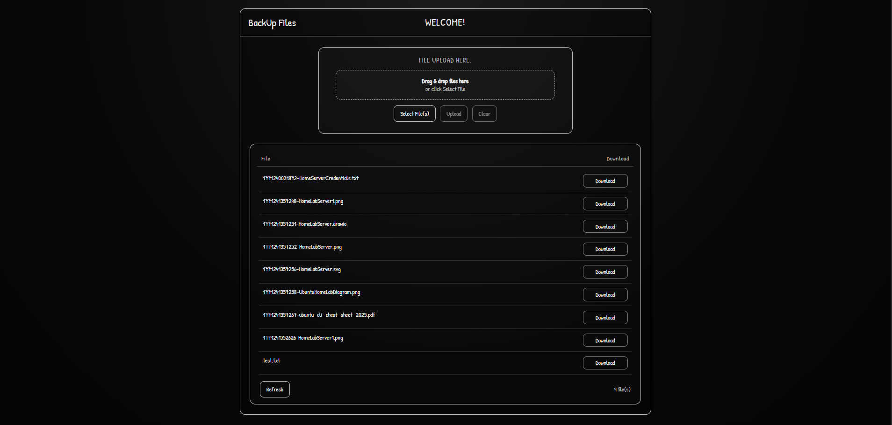

# Simple Backup Web App (Self-Hosted)

A lightweight self-hosted backup web application built using **Node.js**, **Express**, and **Multer**, deployed on a personal **Ubuntu home server** (old laptop).

This project allows file uploads to a local server directory and provides HTTP access to uploaded files.

---

## 🚀 Project Overview

This application was built as part of a home server setup project to:

- Practice backend development
- Learn Linux server management
- Implement file upload handling
- Understand static file serving
- Deploy and manage applications on Ubuntu

---

## 🛠 Tech Stack

- Node.js
- Express.js
- Multer (File Upload Handling)
- dotenv (Environment Variables)
- Ubuntu Desktop (Home Server)
- CORS

---

## 📂 How It Works

- Files are uploaded using `multipart/form-data`
- Files are stored inside a configured server directory
- Uploaded files are accessible via:

---

## ⚙️ Environment Configuration

🧪 Running the Project

1. Install dependencies
npm install

2. Start the server
node server.js

Server runs at:
http://localhost:5000 

## 🔐 Security Notes

This is a personal learning project.
If exposed to the internet, improvements should include:

- Authentication (JWT or sessions)

- File type validation

- Rate limiting

- HTTPS (Nginx + Let's Encrypt)

- Private file access control

## UI

## 👨‍💻 Author
Mark Lester Laroya
